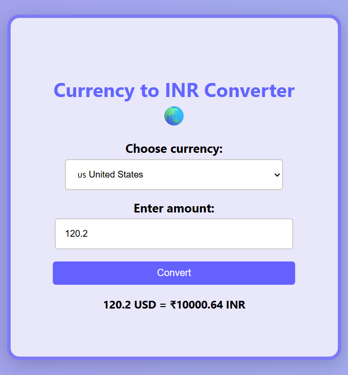
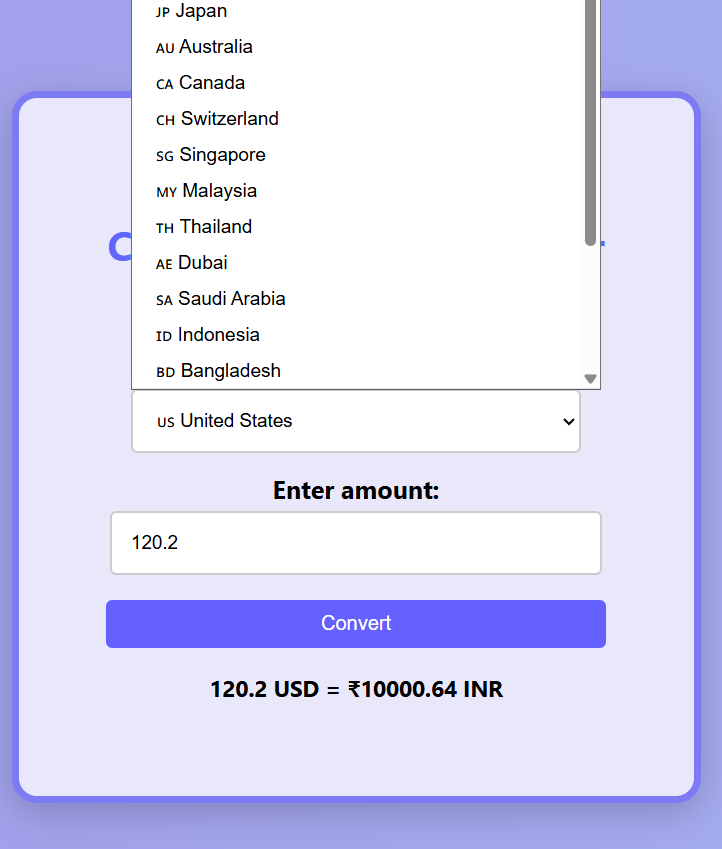

#  Currency Converter

A simple and interactive Currency Converter that allows users to convert foreign currencies into Indian Rupees (INR). Built with *HTML, **CSS, and **JavaScript* as part of my web development learning journey.

#  Screenshot

#  How to Use

1. Select a country from the dropdown.
2. Enter the amount.
3. Click *Convert to INR*.
4. See the result below.

# How I Built It

-  Structured the layout using *HTML* (select dropdown, input field, button, and result box).
-  Styled the UI with *CSS* for a clean and modern design.
-  Used *JavaScript* to:
  - Detect currency and amount
  - Convert using predefined INR exchange rates
  - Display results dynamically

  
#  What I Learned

- DOM manipulation (getElementById, innerText, onclick)
- Creating interactive forms and buttons
- Handling user input and validation
- Using emoji flags with currency select options
- Basics of converting logic using JS objects
- Organizing code for better readability

